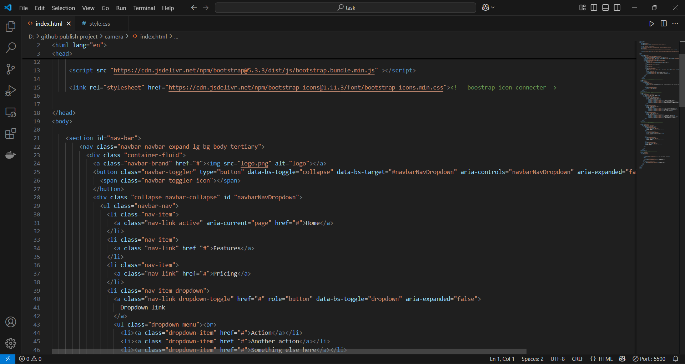

# camera-web-
<h1>output</h1>

<h1>source code</h1>

# 💡  web site! 💡
i created **camera accessories web site.**

## 🛠 Tools used:
✅ visual studeo
✅ chrome

## 🛠 technology used:
✅ HTML
✅CSS
✅ bootstrap

